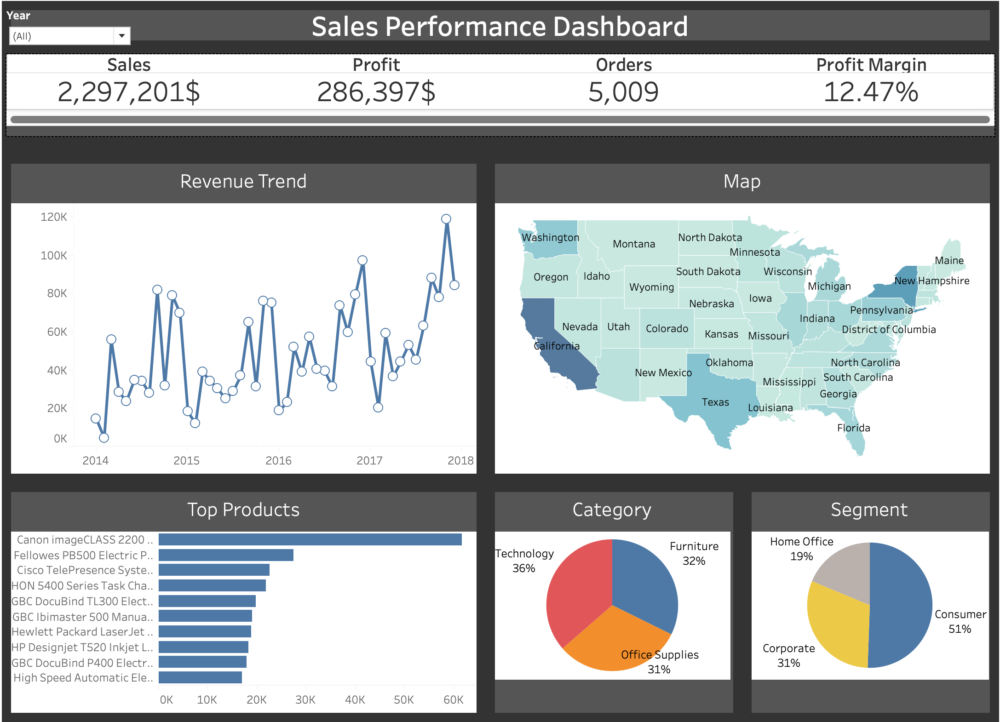

# 📊 FUTURE_DS_01 – Superstore Sales Performance Dashboard

## 📌 Project Overview
**FUTURE_DS_01** is the first task completed as part of the Data Science & Analytics Internship program. The objective was to analyze real-world business sales data and transform raw data into actionable insights using **Tableau**.

This project focuses on solving practical business problems by identifying revenue leaks, analyzing regional performance, and understanding customer purchasing behavior to drive strategic growth.

---

## 🖼️ Dashboard Preview & Demo

### 📸 Static Preview

### 🎥 Interactive Walkthrough

  <video src="https://github.com/kishan992/FUTURE_DS_01/raw/main/dashboard_demo.mp4" width="100%" controls>
    Your browser does not support the video tag.
  </video>

---

## 🎯 Business Questions Addressed
* **Which product categories generate the highest revenue and profit?** (Identification of "Star" products vs. "Loss Leaders").
* **How do sales trends fluctuate over time?** (Analyzing seasonality and Q4 spikes).
* **Which regions are most profitable?** (Identifying areas requiring strategic intervention).
* **Relationship between sales volume and net profit?** (Optimizing for efficiency rather than just volume).

---

## 🧹 Data Preparation & Analysis
* **Data Cleaning:** Organized raw CSV data to ensure consistency in date formats and geographic naming.
* **Calculated Fields:** Created custom Profit Margin and YoY Growth metrics in Tableau.
* **Visualization:** Built an interactive executive-level dashboard with dynamic filtering for Category, Region, and Segment.

---

## 🛠️ Tools Used
* **Tableau Desktop:** Data Visualization & Dashboard Design (`.twbx`)
* **Excel:** Data Preparation & Cleaning
* **Git/GitHub:** Version Control & Documentation

---

## 💡 Skills Demonstrated
* **Business-Focused KPI Analysis**
* **Interactive Dashboard Design**
* **Data Storytelling & Insight Generation**
* **Technical Documentation & Version Control**

---

## 🚀 Conclusion
This project demonstrates the ability to analyze complex sales data, generate strategic insights, and present findings through a professional, client-ready dashboard aligned with real-world business analytics practices.
